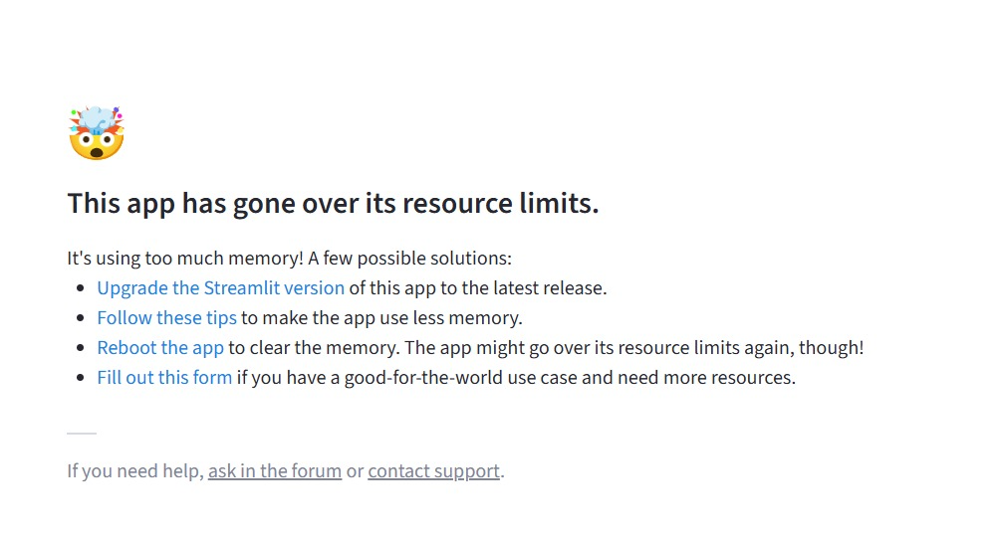

# 🎙 AI Transcription Tool


A clean and modular **offline speech-to-text application** built with **Streamlit** and **Faster-Whisper**.

This application allows users to transcribe speech from multiple sources with a simple interface:

* 📁 Upload audio or video files
* 🎬 Generate transcripts from YouTube videos
* 🎙 Record audio directly from a microphone

The application produces:

* Plain text transcripts
* Timestamped subtitles
* Downloadable **`.txt` transcripts**
* Downloadable **`.srt` subtitle files**

The interface is designed to be simple, focused, and efficient while running entirely on your local machine.

---

# ✨ Features

### 📁 Audio / Video File Transcription

Upload files such as:

* `.mp3`
* `.wav`
* `.m4a`
* `.mp4`

The application will automatically process the audio and generate a transcript.

---

### 🎬 YouTube Video Transcription

Paste any valid YouTube link and the application will:

1. Extract the audio
2. Convert it to WAV
3. Generate a full transcript
4. Provide subtitle downloads

---

### 🎙 Real-time Audio Recording

Record speech directly from your microphone and transcribe it instantly.

Features include:

* microphone access detection
* real-time audio level monitoring
* interruptible recording
* progress tracking
* automatic transcription

---
## Project Structure

```
AI-Transcription-Tool
│
├── app.py                # Main Streamlit application
├── requirements.txt      # Python dependencies
├── README.md             # Project documentation
├── LICENSE               # MIT License
│
├── assets/               # Optional assets (icons / screenshots)
│
└── temp/                 # Temporary audio files generated during runtime
```

---

# ⚙️ Installation

## 1. Clone the Repository

```bash
git clone https://github.com/your-username/ai-transcription-tool.git
cd ai-transcription-tool
```

---

## 2. Create a Virtual Environment

It is recommended to run the application inside a virtual environment.

### Windows

```bash
python -m venv venv
venv\Scripts\activate
```

### macOS / Linux

```bash
python3 -m venv venv
source venv/bin/activate
```

---

## 3. Install Dependencies

```bash
pip install -r requirements.txt
```

---

## 4. Install FFmpeg

The application requires **FFmpeg** for audio conversion.

Download FFmpeg from:

https://ffmpeg.org/download.html

After installing, add the **FFmpeg `bin` folder** to your system **PATH**.

Example path:

```
C:\ffmpeg\bin
```

Verify installation:

```bash
ffmpeg -version
```

If FFmpeg prints version information, it is correctly installed.

---
## System Architecture

The application follows a simple local processing pipeline where all audio processing and transcription happens on the user's machine.

```
User Interface (Streamlit)
        │
        ▼
Input Source
├── Audio File Upload
├── YouTube Video URL
└── Microphone Recording
        │
        ▼
Audio Processing
├── FFmpeg Conversion
└── Audio Normalization
        │
        ▼
Transcription Engine
(Faster-Whisper Model)
        │
        ▼
Output Generation
├── Plain Text Transcript (.txt)
└── Subtitle File (.srt)
        │
        ▼
Downloadable Results
```

All processing happens locally without sending audio data to external servers.
---

# 🚀 Running the Application

Start the Streamlit application:

```bash
streamlit run app.py
```

The interface will open in your browser automatically.

---

# 🧠 Model Configuration

The application uses **Faster-Whisper** with the following default configuration:

```
WhisperModel("base", device="cpu", compute_type="int8")
```

This model provides a **good balance between speed and accuracy** for most systems.

If you prefer **higher accuracy**, you may change the model in the code:

```
"base" → "small" → "medium"
```

Trade-offs:

| Model          | Speed     | Accuracy | Memory Usage |
| -------------- | --------- | -------- | ------------ |
| tiny           | very fast | lowest   | very low     |
| base           | fast      | good     | low          |
| small          | slower    | better   | medium       |
| medium / large | slow      | highest  | high         |

Choose the model that fits your system capabilities.

---

## Performance Notes

The application is optimized for CPU inference using **int8 quantization** in Faster-Whisper.

Typical performance on a standard CPU system:

| Model | Speed     | Accuracy |
| ----- | --------- | -------- |
| tiny  | very fast | lower    |
| base  | fast      | balanced |
| small | slower    | better   |

The default configuration uses the **base model**, which provides a good balance between speed and accuracy for most users.

---

# ⚡ GPU Acceleration (Optional)

If your system has a **powerful GPU**, you can modify the model configuration to run on GPU.

Example:

```python
WhisperModel("small", device="cuda")
```

Using a GPU can significantly improve transcription speed for larger models.

Depending on your use case, you may choose:

* **smaller models for faster speed**
* **larger models for higher transcription accuracy**

---

# 💡 Why This Application Runs Offline

This application was originally tested for online deployment, but practical limitations made offline usage more reliable.

### Resource Limitations

Most free hosting platforms impose strict limits such as:

* limited RAM
* CPU usage caps
* restricted execution time

Speech recognition models require significant resources, which frequently exceeds those limits.

---

### Deployment Cost

Running Whisper models reliably online often requires:

* dedicated servers
* GPU instances
* persistent storage
* continuous runtime

These resources can become expensive for personal projects or small tools.

---

### Offline Advantages

Running the application locally provides several benefits:

* full access to your system's resources
* faster processing without server latency
* no usage restrictions
* no hosting costs
* improved privacy for audio data

For these reasons, this project is designed primarily as a **local transcription utility**.

---

- Well its not that i didnt tried to deploy it, i tried but the resource use of this project was such high that it was taken down  after like 20 min of deployment, see the image below : 


- this is the reason why i kept it offline

--- 
# 📚 Example Use Cases

This tool can be useful in many real-world scenarios:

* generating transcripts for **lectures or meetings**
* creating **subtitles for videos**
* converting **podcasts to text**
* summarizing **YouTube educational content**
* transcribing **interviews or voice notes**
* converting recorded speech into written documents

---

# 🛠 Built With

* **Python**
* **Streamlit**
* **Faster-Whisper**
* **yt-dlp**
* **FFmpeg**
* **SoundDevice**

---

# 📄 License

This project is intended for educational and personal use.

---

# ✍️ Author Note

This project focuses on **simplicity and efficiency rather than feature overload**.

Instead of building a complex cloud platform, the goal was to create a **clean, reliable transcription tool that anyone can run locally without infrastructure or deployment costs.**
